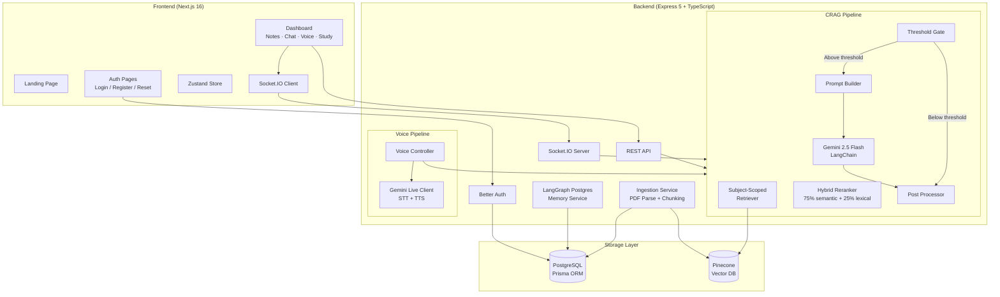
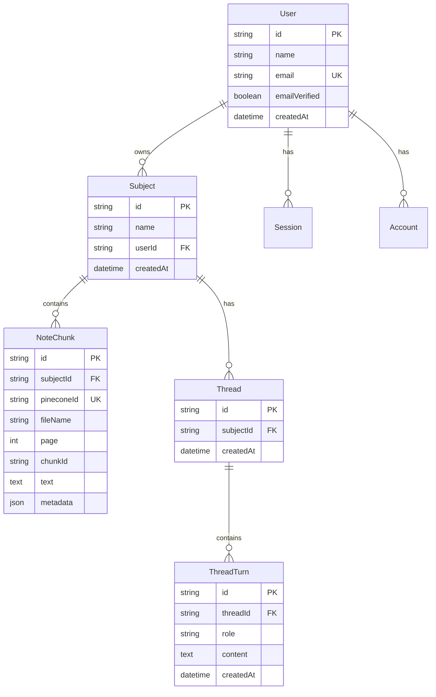

<p align="center">
  
  
  
  
  
  
</p>

# 📚 AskMyNotes

> **AI-powered study companion that turns your notes into an interactive, intelligent tutor.**

Upload your PDFs and text notes, ask questions in natural language — through **text, real-time streaming chat, or voice** — and get grounded, citation-backed answers powered by **Corrective RAG (CRAG)** and **Google Gemini**. Generate quizzes to test your understanding. All answers are strictly limited to your uploaded material — no hallucinations.

---

## 🎯 Problem Statement

Students and learners drown in study material — PDFs, lecture notes, textbooks — yet struggle to quickly find specific answers, revise effectively, and self-test. Existing AI tools either hallucinate freely or require complex setups. **AskMyNotes** solves this by providing:

1. **Controlled, grounded Q&A** — answers come exclusively from your uploaded notes with provenance citations.
2. **Multi-modal interaction** — text chat, real-time streaming, and voice-in/voice-out.
3. **Active recall study mode** — auto-generated MCQs and short-answer questions from your notes.
4. **Subject isolation** — each subject gets its own namespace; cross-contamination of knowledge is impossible.

---

## ✨ Key Features

| Feature | Description |
|---|---|
| 📄 **PDF & TXT Ingestion** | Upload notes in PDF or plain text. Auto-chunked, embedded with `text-embedding-004`, and stored in Pinecone with per-subject namespace isolation. |
| 🔍 **Corrective RAG Pipeline** | Retrieve → Rerank (lexical + semantic blend) → Threshold Gate → Gemini 2.5 Flash → Post-process. If top score is below threshold, the LLM isn't even called. |
| 💬 **Chat with Citations** | Ask questions and get answers with exact file name, page number, chunk ID citations and confidence scores (High/Medium/Low). |
| 🌊 **Real-time Streaming** | Socket.IO streaming delivers token-by-token responses. SSE fallback for REST clients. |
| 🎙️ **Voice Mode** | Speak your question → Gemini Live transcribes → CRAG pipeline answers → Gemini Live synthesizes speech → audio response. Full voice-in/voice-out loop. |
| 🧠 **Thread Memory** | Conversation context is persisted via LangGraph Postgres Checkpointer. Follow-up questions understand prior context. |
| 📝 **Study Mode (Quiz)** | Auto-generated MCQs and short-answer questions with model answers, explanations, and source citations. |
| 🔐 **Authentication** | Email/password auth with email verification, password reset, and Google OAuth via Better Auth. |
| 🛡️ **Security** | Helmet, CORS, rate limiting (30 auth / 20 ask per window), per-user subject ownership validation. |
| 🎨 **Sketchy UI** | Hand-drawn notebook aesthetic with squiggle filters, graph paper backgrounds, sticky notes, and micro-animations. |

---

## 🏗️ Architecture



### CRAG Pipeline Flow

```
User Question
    │
    ▼
┌──────────────────────────────────┐
│  1. Embed query (text-embedding-004) │
│  2. Pinecone query (namespace=subjectId, topK=8) │
│  3. Rerank (0.75×semantic + 0.25×lexical, topN=5)  │
│  4. Threshold gate (score < 0.35?)                │
│     ├─ YES → Return "Not found in your notes"    │
│     └─ NO  → Continue                            │
│  5. Load thread memory (LangGraph Postgres)       │
│  6. Build prompt (system + context + memory)      │
│  7. Gemini 2.5 Flash invoke                       │
│  8. Post-process → structured JSON response       │
│  9. Save turn to thread memory                    │
└──────────────────────────────────┘
    │
    ▼
{ answer, citations[], confidence, evidence[], found }
```

---

## 🛠️ Tech Stack

### Backend
| Technology | Purpose |
|---|---|
| **Express 5** | HTTP server with typed routes |
| **TypeScript (Strict)** | End-to-end type safety |
| **Prisma 7** (PostgreSQL) | ORM for Users, Subjects, NoteChunks, Threads |
| **Pinecone** | Vector database with namespace-per-subject isolation |
| **Google Gemini 2.5 Flash** | LLM for Q&A generation (via LangChain) |
| **Google text-embedding-004** | Embedding model for chunks and queries |
| **Gemini Live API** | Native audio STT/TTS for voice mode |
| **LangGraph** | Postgres-backed checkpointer for thread memory |
| **Socket.IO** | Real-time streaming chat |
| **Better Auth** | Authentication (email + Google OAuth) |
| **Zod** | Runtime request validation |
| **Helmet + express-rate-limit** | Security middleware |

### Frontend
| Technology | Purpose |
|---|---|
| **Next.js 16** (App Router) | React framework with server components |
| **Tailwind CSS 4** | Utility-first styling |
| **Framer Motion** | Animations and transitions |
| **Zustand** | Global state management |
| **Socket.IO Client** | Real-time chat streaming |
| **Lucide React** | Icon library |
| **Better Auth Client** | Auth session management |

---

## 📁 Project Structure

```
ASKMYNOTES/
├── backend/
│   ├── prisma/
│   │   ├── schema.prisma          # Database schema (User, Subject, NoteChunk, Thread)
│   │   ├── checkpointer.sql       # LangGraph checkpointer setup SQL
│   │   └── migrations/            # Prisma migration history
│   ├── src/
│   │   ├── server.ts              # Entry point — HTTP + Socket.IO
│   │   ├── app.ts                 # Express app bootstrap with DI
│   │   ├── config/                # Environment + CRAG config loaders
│   │   ├── controllers/
│   │   │   ├── AskController.ts   # POST /api/ask + /api/ask/stream
│   │   │   ├── IngestionController.ts
│   │   │   └── SubjectController.ts
│   │   ├── services/
│   │   │   ├── crag/              # CragPipelineService + not-found logic
│   │   │   ├── ingestion/         # PDF parsing + chunking + Pinecone upsert
│   │   │   ├── llm/               # Gemini LangChain + Native SDK clients
│   │   │   ├── memory/            # LangGraph Postgres memory service
│   │   │   ├── pinecone/          # Pinecone client factory
│   │   │   ├── postprocess/       # Response structuring
│   │   │   ├── prompt/            # System + human prompt construction
│   │   │   ├── prisma/            # PrismaClient + SubjectRepository
│   │   │   ├── retrieval/         # SubjectScopedRetriever + Reranker
│   │   │   └── auth/              # Better Auth + email templates
│   │   ├── socket/                # Socket.IO server for streaming chat
│   │   ├── voice/                 # Gemini Live STT/TTS + Voice controller
│   │   ├── interfaces/            # Abstractions (IRetriever, IReranker, etc.)
│   │   ├── types/                 # Shared TypeScript types
│   │   └── routes/                # Express route definitions
│   └── package.json
│
└── frontend/
    ├── app/
    │   ├── page.tsx               # Landing page (sketchy notebook theme)
    │   ├── login/page.tsx         # Login
    │   ├── register/page.tsx      # Registration
    │   ├── forgot-password/       # Forgot password flow
    │   ├── reset-password/        # Reset password flow
    │   └── study/page.tsx         # Main dashboard (Notes, Chat, Voice, Study)
    ├── src/
    │   ├── components/
    │   │   ├── dashboard/         # Sidebar, NotesPanel, ChatPanel, VoicePanel,
    │   │   │                      # StudyModePanel, McqCard, ShortAnswerCard, etc.
    │   │   └── CoreLandingPages/  # Landing page UI components
    │   ├── lib/
    │   │   ├── actions.ts         # Backend API client functions
    │   │   ├── auth-client.ts     # Better Auth client
    │   │   ├── socket.ts          # Socket.IO client
    │   │   └── utils.ts           # Utilities (cn, etc.)
    │   └── store/                 # Zustand stores (study, login, register, etc.)
    └── package.json
```

---

## 🚀 Getting Started

### Prerequisites

- **Node.js 22.x**
- **PostgreSQL** (local or hosted)
- **Pinecone** account (free tier works)
- **Google AI Studio** API key (for Gemini + embeddings)

### 1. Clone the Repository

```bash
git clone https://github.com/GreenHacker420/ASKMYNOTES.git
cd ASKMYNOTES
```

### 2. Backend Setup

```bash
cd backend
cp .env.example .env
# Fill in all required values in .env (see Environment Variables below)

npm install
npm run prisma:generate
npm run prisma:migrate
npm run checkpointer:setup   # One-time LangGraph table setup
npm run dev                   # Starts on port 3001
```

### 3. Frontend Setup

```bash
cd frontend
npm install
npm run dev                   # Starts on port 3000
```

### 4. Open the App

Navigate to [http://localhost:3000](http://localhost:3000), register an account, create a subject, upload your notes, and start asking!

---

## ⚙️ Environment Variables

Create a `.env` file in `/backend` with these values:

| Variable | Description | Example |
|---|---|---|
| `DATABASE_URL` | PostgreSQL connection string | `postgresql://user@localhost:5432/askmynotes` |
| `PINECONE_API_KEY` | Pinecone API key | `pc-...` |
| `PINECONE_ENV` | Pinecone environment | `us-east-1` |
| `PINECONE_INDEX` | Pinecone index name | `askmynotes` |
| `GOOGLE_API_KEY` | Google AI Studio key (Gemini + embeddings) | `AIza...` |
| `BETTER_AUTH_SECRET` | Auth signing secret | Random 32+ char string |
| `BETTER_AUTH_URL` | Backend URL for auth | `http://localhost:3001` |
| `BETTER_AUTH_TRUSTED_ORIGINS` | Allowed frontend origins | `http://localhost:3000` |
| `SMTP_HOST` / `SMTP_PORT` / `SMTP_USER` / `SMTP_PASS` | Email for verification/reset | Gmail SMTP details |
| `NOT_FOUND_THRESHOLD` | Min reranked score to call LLM | `0.35` |
| `CHUNK_SIZE` | Characters per chunk | `1200` |
| `CHUNK_OVERLAP` | Overlap between chunks | `200` |
| `TOP_K` | Pinecone retrieval count | `8` |
| `RERANK_TOP_N` | Chunks passed to LLM after reranking | `5` |
| `GEMINI_MODEL` | Gemini model name | `gemini-2.5-flash` |
| `FRONTEND_URL` | Frontend URL for CORS | `http://localhost:3000` |

---

## 🔌 API Endpoints

| Method | Endpoint | Auth | Description |
|---|---|---|---|
| `GET` | `/api/health` | ❌ | Health check |
| `GET` | `/api/subjects` | ✅ | List user's subjects |
| `POST` | `/api/subjects` | ✅ | Create a new subject |
| `GET` | `/api/subjects/:id/files` | ✅ | List files for a subject |
| `POST` | `/api/subjects/:id/files` | ✅ | Upload & ingest a file |
| `POST` | `/api/ask` | ✅ | Ask a question (JSON response) |
| `POST` | `/api/ask/stream` | ✅ | Ask a question (SSE stream) |
| `POST` | `/api/voice/query` | ✅ | Voice-in → answer → voice-out |
| `ALL` | `/api/auth/*` | — | Better Auth routes |

**Socket.IO Events:**

| Event | Direction | Payload |
|---|---|---|
| `ask` | Client → Server | `{ question, subjectId, threadId, requestId?, subjectName? }` |
| `ask:chunk` | Server → Client | `{ requestId, delta }` |
| `ask:final` | Server → Client | `{ requestId, response: AskResponsePayload }` |
| `ask:error` | Server → Client | `{ requestId, error }` |

---

## 🗃️ Database Schema



---

## 🔒 Security & Guardrails

- **No hallucinations**: If retrieval scores fall below the configured threshold (`NOT_FOUND_THRESHOLD`), the LLM is never called. The response is a deterministic "Not found in your notes for [Subject]".
- **Namespace isolation**: Each subject uses its own Pinecone namespace (`namespace = subjectId`). Cross-subject knowledge leakage is impossible.
- **User ownership**: Every subject query validates that the requesting user owns the subject.
- **Rate limiting**: Auth routes: 30 req/15min. Ask routes: 20 req/min.
- **Input validation**: All payloads validated with Zod schemas before processing.

---

## 👥 Team

**Team Horizon**

---

## 📄 License

This project was built for a hackathon. See the repository for license details.
